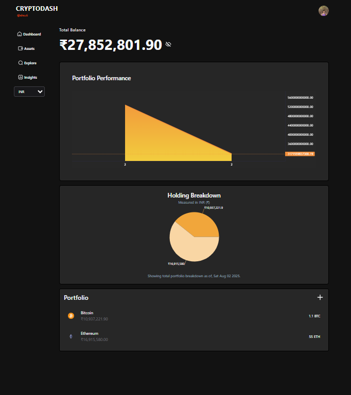
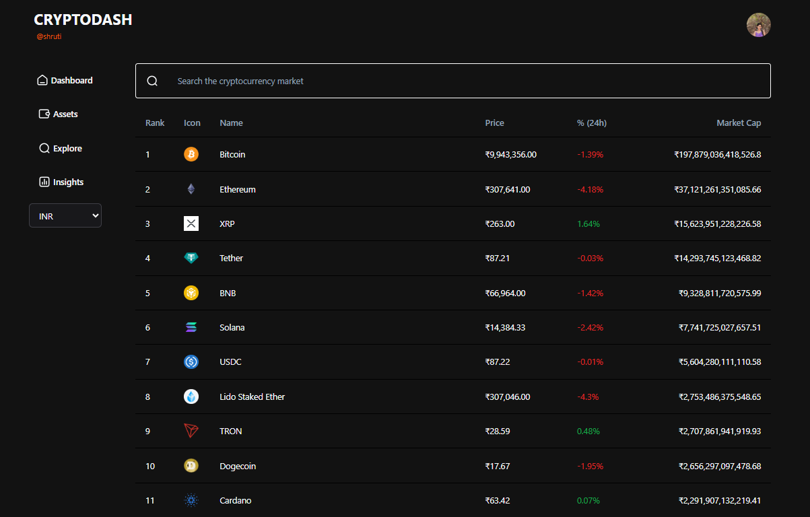
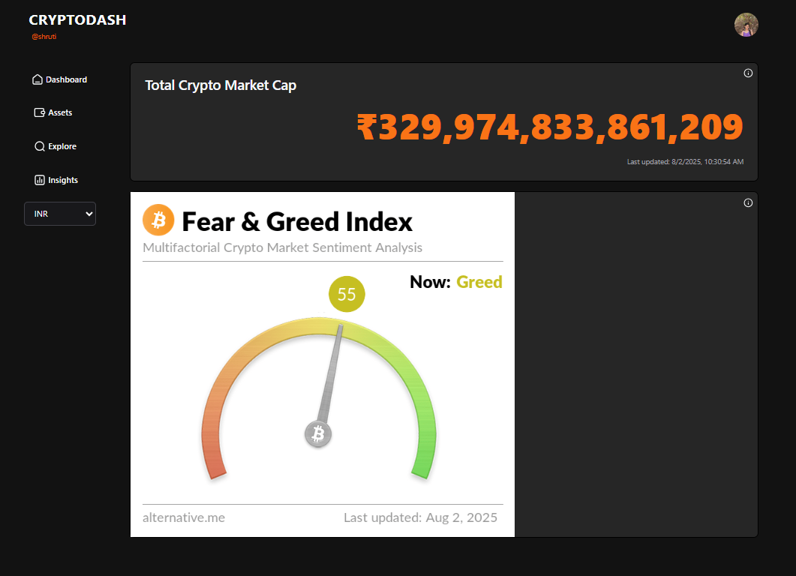
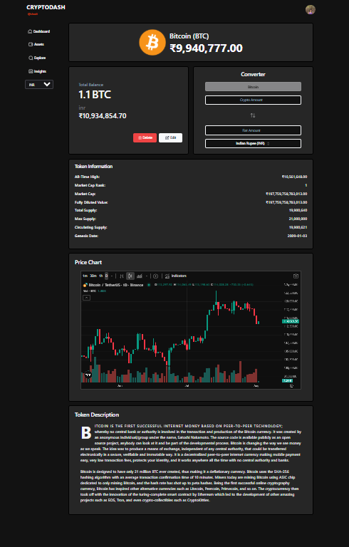

# 🪙 CryptoDash - Final Semester Project

## 🖥️ Live Demo

👉 [CryptoDash Live](https://cryptodashe.netlify.app/)

---

## 📚 About the Project

**CryptoDash** is a cryptocurrency tracking and portfolio management web application built as a final semester academic project. It enables users to monitor real-time prices of over 10,000 tokens, manage holdings, and gain insights using market indicators like the Fear & Greed Index and global market cap.

This full-stack project leverages the **MERN Stack** (MongoDB, Express.js, React.js, Node.js), and integrates **CoinGecko API**, **AWS S3**, and **TradingView Lightweight Charts** for data visualization and cloud storage.

---

## 🚀 Features

- ✅ **Portfolio Tracking** – Add and manage your cryptocurrency investments
- 📈 **Live Market Data** – Real-time updates from 10,000+ coins
- 📊 **TradingView Charts** – Interactive performance visualization
- 🌍 **Market Insights** – Global market cap & Fear & Greed Index integration
- 🌓 **Light & Dark Mode** – Toggle between UI themes
- 🧭 **Intuitive UI** – Seamless navigation and responsive design
- 📧 **Email Alerts** *(optional backend feature)* – Send user notifications

---

## 🛠️ Installation & Setup

### ✅ Prerequisites

- Node.js (v14 or above)
- MongoDB (local or cloud e.g., MongoDB Atlas)
- npm or yarn
- AWS Account (S3 Bucket)
- CoinGecko API Key
- SMTP Email (Gmail or similar) for alerts

---

### 📥 Clone and Install

```bash
git clone https://github.com/yourusername/cryptodash.git
cd cryptodash
````

#### Install Backend

```bash
cd server
npm install
```

#### Install Frontend

```bash
cd ../client
npm install
```

---

### ⚙️ Environment Variables

#### 🔐 `/client/.env`

```env
VITE_API_BASE_URL=http://localhost:5000
```

#### 🔐 `/server/.env`

```env
MONGO_URI=your_mongodb_uri
JWT_ACCESS_SECRET=your_access_token_secret
JWT_REFRESH_SECRET=your_refresh_token_secret
COINGECKO_API_KEY=your_coingecko_api_key
EMAIL_USER=your_email@example.com
EMAIL_PASS=your_email_app_password
BUCKET_NAME=your_aws_s3_bucket_name
BUCKET_REGION=your_aws_s3_bucket_region
AWS_ACCESS_KEY_ID=your_aws_access_key_id
AWS_SECRET_ACCESS_KEY=your_aws_secret_access_key
ORIGIN_URL=http://localhost:5173
NODE_ENV=production
NPM_CONFIG_PRODUCTION=false
```

---

### ▶️ Run the Application Locally

Start Backend:

```bash
cd server
npm run dev
```

Start Frontend:

```bash
cd ../client
npm run dev
```

Open your browser at: [http://localhost:5173](http://localhost:5173)

---

## 📸 Screenshots

### 🔹 Homepage


### 🔹 Portfolio Tracker(Assets)



### 🔹 Explore Coins



### 🔹 Market Insights



### 🔹 Coin Details



---

## 📡 APIs & Libraries Used

* [CoinGecko API](https://www.coingecko.com/en/api) – Real-time crypto data
* [TradingView Lightweight Charts](https://www.tradingview.com) – Interactive price charts
* [Fear & Greed Index](https://alternative.me/crypto/fear-and-greed-index/#api) – Market sentiment analysis
* AWS S3 – Cloud storage for user files (optional)

---

## 🙌 Authors

* **Shruti Tingare** 

---

## 📜 License

This project is intended for educational and academic use only.
All third-party APIs, charts, and services are credited to their original authors.

---
